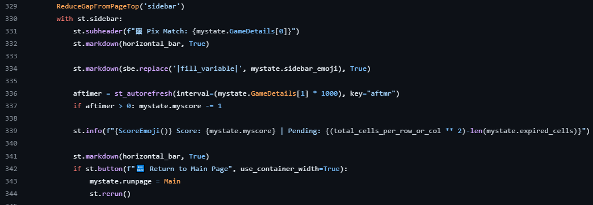

# Requistos vs código
## Requisitos Funcionales y Criterios de Aceptación

| Requisito y Criterios de Aceptación                                   | Código/Imagen                         |
|-----------------------------------------------------------------------|---------------------------------------|
| **3. Configuración de Nivel de Dificultad** **Requisito:** El sistema debe permitir a los jugadores seleccionar el nivel de dificultad antes de comenzar el juego. **Criterios de Aceptación:** - Opciones de dificultad fácil, medio y difícil disponibles para selección. - La configuración de dificultad debe influir en la mecánica del juego, como la frecuencia de regeneración de imágenes y la puntuación. - Tiempos de regeneración específicos:   - Fácil: cada 8 segundos.   - Medio: cada 6 segundos.   - Difícil: cada 5 segundos. |                    |
| **2. Inicialización del Tablero** **Requisito:** Al comenzar un juego, el sistema debe inicializar el tablero con un conjunto aleatorio de imágenes basado en la dificultad seleccionada. **Criterios de Aceptación:** - El tablero debe ser llenado con imágenes de emojis que corresponden a la dificultad elegida. - Ninguna imagen objetivo (emoji de la barra lateral) debe aparecer más de una vez en el tablero inicial. - La imagen objetivo debe ser seleccionada aleatoriamente y mostrada en la barra lateral. |                |
| **3. Parametrización del Nombre del Jugador y País** **Requisito:** El sistema debe permitir a los jugadores ingresar su nombre y país antes de comenzar el juego. **Criterios de Aceptación:** - Debe existir un campo de texto para que los jugadores ingresen su nombre y país. - Es posible que los campos de nombre y país estén vacíos, pero en ese caso no se muestra el _Leaderboard_ - La información del jugador debe persistir durante la sesión de juego. |             |
| **4. Gestión de Puntuación y Temporizador** **Requisito:** El sistema debe ser capaz de gestionar y actualizar el puntaje del jugador en tiempo real, así como también gestionar el temporizador del juego. **Criterios de Aceptación:** - La puntuación debe incrementarse cuando el jugador selecciona una casilla correcta y disminuirse si selecciona una casilla incorrecta. - El temporizador debe iniciar al comenzar el juego y detenerse cuando se alcanza el final del juego o el jugador decide salir. - La puntuación y el temporizador deben mostrarse en la interfaz de usuario durante toda la sesión de juego. |             |
| **5. Finalización y Registro del Juego** **Requisito:** Al finalizar el juego, el sistema debe registrar la puntuación del jugador y mostrarla en una tabla de clasificación, si corresponde. **Criterios de Aceptación:** - La puntuación final del jugador debe mostrarse en la interfaz de usuario al finalizar el juego. - Si la puntuación del jugador es lo suficientemente alta como para clasificar en la tabla de clasificación, esta debe actualizarse para incluir al jugador. - La tabla de clasificación debe mostrarse al jugador si su puntuación es lo suficientemente alta como para clasificar. - La información de la tabla de clasificación debe persistir entre sesiones de juego. |             |
