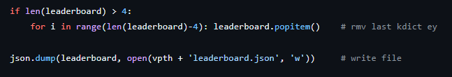
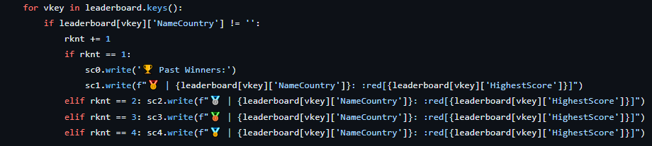
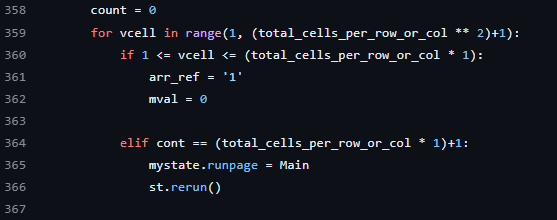

## Evidencia del cambio
> Ponga aquí evidencia con imágenes y fragmento de código

#### Archivo Json guarda 4 jugadores

#### Interfa gráfica muestra cuatro jugadores

#### Usuario pierde el juego cuando supera un máximo posible de fallos.

## Encuesta de la experiencia
Por favor, responde las siguientes preguntas basadas en tu experiencia modificando el código para incluir cuatro personas en el leaderboard en lugar de tres.

**Nombre:**

#### 1. ¿Cuánto tiempo te llevó entender las secciones del código relacionada con el leaderboard?
- [ ] Menos de 10 minutos
- [x] Entre 10 y 30 minutos
- [ ] Entre 30 minutos y 1 hora
- [ ] Más de 1 hora

#### 2. ¿Cuánto tiempo te llevó entender las secciones del código relacionada con hacer que el usuario pierda si supera x cantidad de turnos?
- [ ] Menos de 10 minutos
- [x] Entre 10 y 30 minutos
- [ ] Entre 30 minutos y 1 hora
- [ ] Más de 1 hora

#### 3. ¿Consideras que estaba documentada la lógica en el código para facilitar el cambio?
- [x] Sí
- [ ] No

#### 4. ¿Te pareció fácil identificar dónde y qué cambios realizar para aumentar el número de personas en el leaderboard de 3 a 4?
- [ ] Muy fácil
- [x] Algo fácil
- [ ] Algo difícil
- [ ] Muy difícil

#### 5. ¿Te pareció fácil identificar dónde y qué cambios realizar para agregar la lógica de perder el juego?
- [ ] Muy fácil
- [ ] Algo fácil
- [x] Algo difícil
- [ ] Muy difícil

#### 5. ¿Qué tan seguro te sientes de que tus cambios no introdujeron errores en otras áreas del código?
- [ ] Muy seguro
- [x] Moderadamente seguro
- [ ] Poco seguro
- [ ] Nada seguro

#### 6. Después de realizar los cambios, ¿cuánto tiempo te tomó verificar que el cambio funcionó como se esperaba?
- [x] Menos de 10 minutos
- [ ] Entre 10 y 30 minutos
- [ ] Entre 30 minutos y 1 hora
- [ ] Más de 1 hora

#### 7. ¿Qué estrategia usaste para verificar que no habían problemas en el código fuente?

Compilar el codigo y comprobar que todo funcione correctamente.

#### 8. ¿Te enfrentaste a algún problema mientras intentabas realizar los cambios? Si es así, ¿cómo lo resolviste?
- [ ] No enfrenté problemas
- [ ] Revisé la documentación del código
- [x] Busqué ayuda de un compañero o en línea
- [ ] Otro (especificar)
